# 🧾 AI Invoice Assistant

An end-to-end system that automates invoice processing with **document ingestion**, **retrieval-augmented generation (RAG)**, and **voice-enabled interaction**.

Users can:

* Upload invoices (PDF, images, DOCX).
* Ask invoice-related questions via **chat** or **voice**.
* Get responses with **speech playback**.

---

## ⚙️ Architecture



**Services:**

* **Frontend** → User interface built with Streamlit.
* **Ingestion** → Extracts text & embeddings from uploaded invoices.
* **Chat** → Handles user queries, retrieves context from Qdrant, calls LLM.
* **Voice** → Speech-to-Text (STT) and Text-to-Speech (TTS).
* **Qdrant** → Vector database for semantic search.
* **Redis** → Caching for faster repeated queries.

---

## 🚀 Setup & Run

If you wish to use it without downloading the code check it out here
[Link](google.com)


### 1. Clone Repo

```bash
git clone <your-repo-url>
cd <your-repo>
```

### 2. Add Environment Variables

Create a `.env` file in the project root:

```ini
# Gemini API key (required)
GEMINI_API_KEY=your_gemini_api_key_here

# Optional: other configs (e.g., Redis password if needed)
```

### 3. Build & Start Services

```bash
docker compose build
docker compose up -d
```

This will start:

* **Frontend** → `http://localhost:8501`
* **Chat Service** → `http://localhost:8002`
* **Ingestion Service** → `http://localhost:8001`
* **Voice Service** → `http://localhost:8003`
* **Qdrant** → `http://localhost:6333`
* **Redis** → `localhost:6379`

Check service health:

```bash
docker compose ps
```


### 4. Use the App

* Open [http://localhost:8501](http://localhost:8501).
* Upload invoices → check status.
* Ask queries via chat or record a voice query.
* Listen to AI-generated responses.

---

## 🛠️ Development Notes

* All services are containerized.
* Ingestion cleans up files after processing.
* Qdrant schema is auto-created on first run (`invoice_rag` collection).
* Redis caches responses for efficiency.
* Voice service depends on `python-multipart` for form-data handling.

---

## 📂 Project Structure

```
services/
 ├── frontend/   # Streamlit UI
 ├── ingestion/  # Invoice processing & embedding
 ├── chat/       # LLM query service
 ├── voice/      # STT + TTS
docker-compose.yml
README.md
```

---

## 🎥 Demo
